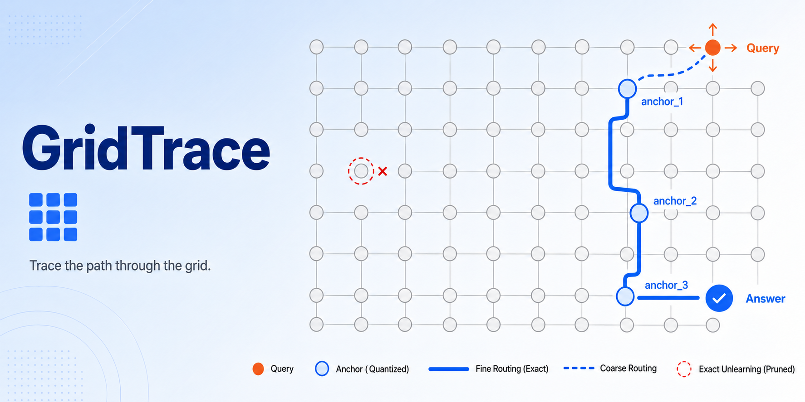

<p align="center">
  
</p>
<p align="center">
  <strong>GridTrace</strong> — Trace the path through the grid
</p>
<p align="center">
  <em>Retrieval at the fundamental particle scale</em>
</p>

<p align="center">
  <a href="https://github.com/guts-yang/GridTrace/actions"></a>
  <a href="https://github.com/guts-yang/GridTrace/blob/main/LICENSE"></a>
  
</p>

## What is GridTrace?

A RAG retrieval algorithm that compresses vectors into **grid-quantized anchors**
and runs a two-phase search — anchor-level routing then full-precision rerank —
with **exact unlearning** in `O(1)` per document. No clustering, no PQ, no index rebuild.

| Feature | What it does |
|---|---|
| Grid quantization | `round(v/ε)·ε` → deterministic anchor, `O(d)` |
| Two-phase retrieval | L1 anchor Top-K → L2 cosine rerank |
| Exact unlearning | Delete `doc_id` → orphan anchors auto-pruned |
| Pluggable storage | `pgvector` (prod) / `sqlite` (dev) / `memory` (eval) |

## Algorithm

### 1. Grid Quantization
```
anchor_vec = round(v / ε) × ε
quant_key  = SHA256(anchor_vec)
```
Entries sharing the same `quant_key` share the same anchor. No training, fully deterministic.

### 2. Two-Phase Retrieval
| Phase | Operation | Cost |
|---|---|---|
| L1 | anchor-table cosine, Top-K | `O(A × d)` |
| L2 | full-precision cosine + threshold | `O(C × d)` |

### 3. Exact Unlearning
Delete all entries → check anchor ref-count → drop orphans. Runs in `O(1)` per document.

## Quick Start

**Requirements:** Python ≥ 3.11, PostgreSQL ≥ 16 with `pgvector` (or use `sqlite` / `memory`).

```bash
git clone https://github.com/guts-yang/GridTrace.git
cd GridTrace
pip install -e ".[dev,embed]"
cp .env.example .env       # then edit
docker compose up -d postgres
make dev                   # uvicorn --reload on :8000
```

**Verify:**
```bash
curl -X POST http://localhost:8000/api/chat \
  -H "Content-Type: application/json" \
  -d '{"query": "How do I reset a frozen account?"}'
```

**Run tests & eval:** `make lint test eval` → see [`docs/eval_report.md`](docs/eval_report.md).

## Project Layout

```
GridTrace/
├── src/gridtrace/   # core algorithm (src-layout)
├── api/             # FastAPI REST layer
├── data/            # FAQ + evaluation datasets
├── docs/            # algorithm / architecture / eval reports
├── scripts/         # ingest / reset / run_eval
├── tests/           # unit / integration / eval
└── docker/          # Dockerfiles + init.sql
```

## License

Apache-2.0 — see [`LICENSE`](LICENSE).
